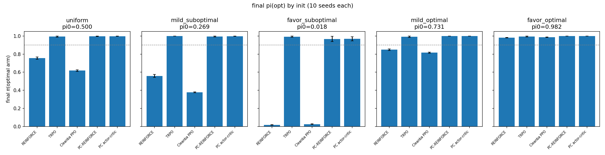

# PCPG — Predictive Coding Policy Gradients

On-policy policy gradients in JAX, comparing backprop-trained policies against predictive-coding-trained ones ([jpc](https://github.com/thebuckleylab/jpc)).

## Structure

```
src/
  backprop_algorithms/   # REINFORCE, PPO, Cleanba PPO, TRPO (from PolicyGradientsJax / CleanRL)
  pc_algorithms/         # PC-REINFORCE, PC actor-critic (jpc, no backprop)
  networks/              # MLP/CNN, distributions (from PolicyGradientsJax)
  env/                   # Procgen wrapper + 2-armed bandit
configs/                 # YAML configs + bandit_inits.yaml
scripts/                 # run_train.py, run_bandit_comparison.py, run_bandit_multi_init.py
results/                 # committed plots, logs, CSVs
```

Each algorithm file has an inline `Config` and a `main()`; `run_train.py` maps the YAML onto `Config` and dispatches via `agent.algorithm`.

## Setup

```bash
pip install -e .
git config core.hooksPath .githooks   # once per clone
```

Use JAX 0.4.38 + Flax 0.10.2 + Optax 0.2.4 (jpc needs JAX <= 0.5.2, the pmap code breaks on newer JAX anyway). For GPU: `pip install -e ".[gpu]"` (CUDA 12).

## Running

```bash
# Procgen
python scripts/run_train.py --config configs/default.yaml
python scripts/run_train.py --config configs/default.yaml --overrides agent.algorithm=trpo seed=7

# bandit (results/bandit_{init}_seed{seed}/; favor_suboptimal legacy: bandit_seed{seed}/)
python scripts/run_bandit_comparison.py --seed 1   # default init: favor_suboptimal
python scripts/run_bandit_multi_seed.py          # favor_suboptimal × seeds 1–10
python scripts/summarize_bandit_seeds.py         # -> results/bandit_multi_seed/
python scripts/run_bandit_multi_init.py          # 5 inits × seeds 1–10
python scripts/summarize_bandit_inits.py         # -> results/bandit_multi_init/

# eval a checkpoint
python scripts/run_eval.py --config configs/default.yaml \
    --checkpoint outputs/checkpoints/<name>.params --num-episodes 50
```

## Results

2-armed bandit (arm means 1.0 / 0.9), 60k steps. Policy is a softmax with final-layer kernel zeroed; bias init `[b₀, b₁]` sets π₀(opt) = sigmoid(b₀ − b₁).

### favor_suboptimal init, 10 seeds (1–10)

π₀(opt) ≈ 2% via logit bias `[0, 4]` — the softmax plateau where vanilla PG stalls. Aggregates in `results/bandit_multi_seed/`:


| | final π(opt) mean ± SEM | success (≥0.9) | median steps to 0.9 |
|---|---|---|---|
| TRPO | 0.993 ± 0.007 | 10/10 | 6000 |
| PC-REINFORCE | 0.968 ± 0.029 | 9/10 | 38000 |
| PC actor-critic | 0.969 ± 0.024 | 9/10 | 44000 |
| Cleanba PPO | 0.026 ± 0.003 | 0/10 | — |
| REINFORCE | 0.018 ± 0.003 | 0/10 | — |

### Five policy inits × 10 seeds

Sweep π₀ from 2% to 98%. Presets in `scripts/bandit_inits.py`:

| init | logit bias | π₀(opt) |
|---|---|---|
| favor_suboptimal | [0, 4] | 0.02 |
| mild_suboptimal | [0, 1] | 0.27 |
| uniform | [0, 0] | 0.50 |
| mild_optimal | [1, 0] | 0.73 |
| favor_optimal | [4, 0] | 0.98 |



| init (π₀) | TRPO | PC-REINFORCE | PC actor-critic | Cleanba PPO | REINFORCE |
|---|---|---|---|---|---|
| favor_optimal (98%) | 0.995 ± 0.005 (10/10) | 1.000 ± 0.000 (10/10) | 1.000 ± 0.001 (10/10) | 0.987 ± 0.002 (10/10) | 0.982 ± 0.003 (10/10) |
| mild_optimal (73%) | 0.992 ± 0.008 (10/10) | 0.999 ± 0.001 (10/10) | 0.999 ± 0.001 (10/10) | 0.816 ± 0.007 (0/10) | 0.849 ± 0.009 (0/10) |
| uniform (50%) | 0.994 ± 0.006 (10/10) | 0.996 ± 0.002 (10/10) | 0.998 ± 0.001 (10/10) | 0.618 ± 0.010 (0/10) | 0.756 ± 0.012 (0/10) |
| mild_suboptimal (27%) | 1.000 ± 0.000 (10/10) | 0.994 ± 0.004 (10/10) | 0.998 ± 0.001 (10/10) | 0.378 ± 0.006 (0/10) | 0.559 ± 0.017 (0/10) |
| favor_suboptimal (2%) | 0.993 ± 0.007 (10/10) | 0.968 ± 0.029 (9/10) | 0.969 ± 0.024 (9/10) | 0.026 ± 0.003 (0/10) | 0.018 ± 0.003 (0/10) |

Values are final π(opt) mean ± SEM; parentheses are seeds with final π ≥ 0.9. TRPO and both PC variants succeed from every start; REINFORCE and PPO only when π₀ is already high. Full stats in `results/bandit_multi_init/`.

## TODO

- scale PCPG to Procgen (multi-step TD)
- replace hand-rolled distributions with distrax
