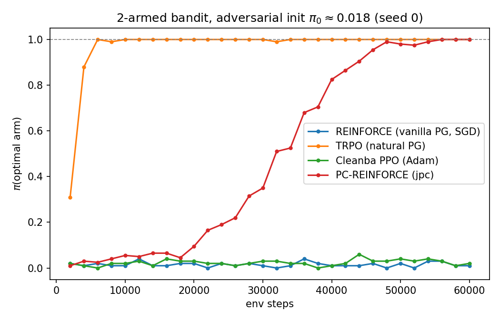

# PCPG — Predictive Coding Policy Gradients

On-policy policy gradient algorithms in JAX/Flax for investigating predictive coding in reinforcement learning.

## Algorithms

| Algorithm | File | Description |
|-----------|------|-------------|
| REINFORCE | `src/backprop_algorithms/reinforce.py` | Vanilla policy gradient with Monte Carlo returns |
| PPO | `src/backprop_algorithms/ppo.py` | Proximal Policy Optimization (clipped surrogate) |
| Cleanba PPO | `src/backprop_algorithms/cleanba_ppo.py` | Cleanba/CleanRL-style PPO baseline (GAE once per iteration, flattened minibatches, clipped value loss, Adam eps 1e-5) |
| TRPO | `src/backprop_algorithms/trpo.py` | Trust Region Policy Optimization (conjugate gradient + line search) |
| PC-REINFORCE | `src/pc_algorithms/pc_reinforce.py` | REINFORCE with a predictive-coding-trained policy ([jpc](https://github.com/thebuckleylab/jpc)): advantage-weighted output targets, no backprop |
| PCPG | `src/backprop_algorithms/pcpg.py` | Predictive Coding Policy Gradients (WIP) |

PPO, TRPO, and REINFORCE are adapted from [PolicyGradientsJax](https://github.com/Matt00n/PolicyGradientsJax).

## Project Structure

```
src/
  backprop_algorithms/   # Backprop-trained policy gradients (REINFORCE, PPO, Cleanba PPO, TRPO)
  pc_algorithms/         # Predictive-coding-trained policy gradients (jpc)
  networks/              # Shared MLP/CNN, distributions, policy interface (from PolicyGradientsJax)
  env/                   # Vectorized env wrappers: Procgen + 2-armed bandit
  utils/
configs/                 # Experiment configs (YAML)
scripts/                 # Training, evaluation, and comparison entry points
results/                 # Committed experiment artifacts (plots, logs, CSVs)
```

## Setup

```bash
pip install -e .
```

After cloning, enable the repo's git hooks (strips AI agent attribution from commit messages):
```bash
git config core.hooksPath .githooks
```

For GPU (requires CUDA 12 on the host — RunPod "PyTorch 2.x" base images ship this):
```bash
pip install -e ".[gpu]"
python -c "import jax; print(jax.devices())"   # expect [CudaDevice(id=0)]
```

## Running

```bash
# train
python scripts/run_train.py --config configs/default.yaml
python scripts/run_train.py --config configs/default.yaml --overrides agent.algorithm=trpo seed=7

# eval (after a checkpoint lands in outputs/checkpoints/)
python scripts/run_eval.py \
    --config configs/default.yaml \
    --checkpoint outputs/checkpoints/Exp_ppo_procgen__coinrun__42.params \
    --num-episodes 50
```

`run_train.py` reads the YAML, overrides the inline `Config` class on the selected algorithm module, and calls its `main()`. Checkpoints are written to `outputs/checkpoints/` unless `--no-save` is passed.

## The bandit experiment: vanilla PG vs natural PG vs predictive coding

### Setup

`src/env/bandit.py` implements the simplest possible RL problem: a 2-armed bandit with 1 state (constant observation), 2 actions, and 1-step episodes. Arm 0 pays 1.0, arm 1 pays 0.9 (configurable via `env.arm_means`), rewards deterministic by default.

The policy is a softmax over logits, initialized **adversarially** (`agent.policy_init_logit_bias: [0.0, 4.0]`): the policy starts at pi(optimal arm) ~ 1.8%. This creates a plateau that cleanly separates the algorithm families:

- **Vanilla PG** (and any plain first-order method): the gradient on the logit gap is `pi * (1 - pi) * gap` ~ 0.002 at the init — stuck on a plateau of length ~1/pi updates, for any step size.
- **Natural PG**: preconditions with the inverse Fisher information (`1 / (pi * (1 - pi))` for a 2-arm softmax), which exactly cancels the vanishing factor — constant progress in logit space per update, independent of the current policy (Mei et al. 2020: softmax PG converges O(1/t) with plateau-dependent constants, NPG linearly).
- **Predictive coding** sits in between: the PC inference dynamics implicitly precondition the learning signal (partially, not exactly like the Fisher).

### Results



| Algorithm | final pi(opt) | avg pi(opt) | behavior |
|-----------|---------------|-------------|----------|
| TRPO (natural PG) | 1.000 | 0.972 | escapes the plateau in ~3 updates |
| PC-REINFORCE (jpc) | 1.000 | 0.487 | escapes gradually, converged by ~50k steps |
| Cleanba PPO (Adam) | 0.020 | 0.023 | pinned to the plateau |
| REINFORCE (SGD) | 0.010 | 0.015 | pinned to the plateau |

Reproduced on seeds 0 and 7 (60k env steps each). Full per-update logs, the plotted CSV data, and the figure are committed under `results/bandit_seed0/`.

### Reproduce

```bash
# full 4-way comparison + plot + logs (written to results/bandit_seed{seed}/)
python scripts/run_bandit_comparison.py --seed 0

# any subset
python scripts/run_bandit_comparison.py --algos reinforce trpo --seed 0

# single algorithm via the standard entry point
python scripts/run_train.py --config configs/bandit.yaml   # cleanba_ppo by default
```

### PC-REINFORCE (predictive coding via jpc)

`src/pc_algorithms/pc_reinforce.py` trains the policy as a predictive coding network using [jpc](https://github.com/thebuckleylab/jpc) — no backprop through the policy. Each update:

1. rolls out the bandit and computes advantages `A = r - mean(r)`,
2. builds advantage-weighted output targets `y = logits + alpha * A(a) * (onehot(a) - pi)`, chosen so the PC output error `y - logits` equals the REINFORCE gradient w.r.t. the logits,
3. calls `jpc.make_pc_step`, which relaxes the network activities to equilibrium (diffrax ODE solver) and applies local PC weight updates at that equilibrium.

## Dependencies

JAX, Flax, Optax, procgen-mirror, gym3, pyyaml, wandb, matplotlib, jpc (equinox/diffrax).

Note: jpc requires JAX 0.4.38-0.5.2; the pmap-based algorithms also rely on `jax.device_put_replicated`, which was removed in newer JAX. JAX 0.4.38 + Flax 0.10.2 + Optax 0.2.4 is a known-good combination.

## Notes

- integrarte Distrax from GoogleDeeping - replace the distributions
- PPO, TRPO, and REINFORCE implementation taken from https://github.com/Matt00n/PolicyGradientsJax 
