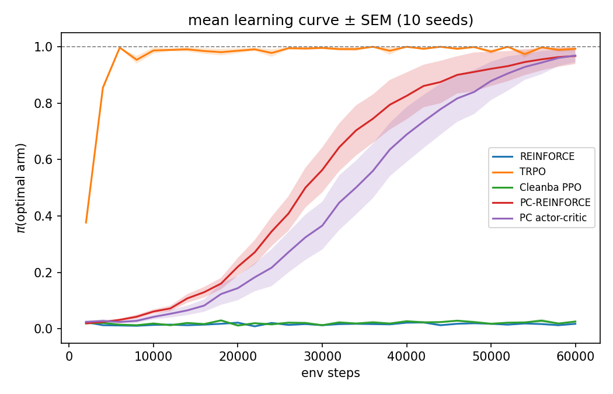

# PCPG — Predictive Coding Policy Gradients

On-policy policy gradients in JAX, comparing backprop-trained policies against predictive-coding-trained ones ([jpc](https://github.com/thebuckleylab/jpc)).

## Structure

```
src/
  backprop_algorithms/   # REINFORCE, PPO, Cleanba PPO, TRPO (from PolicyGradientsJax / CleanRL)
  pc_algorithms/         # PC-REINFORCE, PC actor-critic (jpc, no backprop)
  networks/              # MLP/CNN, distributions (from PolicyGradientsJax)
  env/                   # Procgen wrapper + 2-armed bandit
configs/                 # YAML configs
scripts/                 # run_train.py, run_eval.py, run_bandit_comparison.py
results/                 # committed plots, logs, CSVs
```

Each algorithm file has an inline `Config` and a `main()`; `run_train.py` maps the YAML onto `Config` and dispatches via `agent.algorithm`.

## Setup

```bash
pip install -e .
git config core.hooksPath .githooks   # once per clone
```

Use JAX 0.4.38 + Flax 0.10.2 + Optax 0.2.4 (jpc needs JAX <= 0.5.2, the pmap code breaks on newer JAX anyway). For GPU: `pip install -e ".[gpu]"` (CUDA 12).

## Running

```bash
# Procgen
python scripts/run_train.py --config configs/default.yaml
python scripts/run_train.py --config configs/default.yaml --overrides agent.algorithm=trpo seed=7

# bandit comparison (plot + logs go to results/bandit_seed{seed}/)
python scripts/run_bandit_comparison.py --seed 0
python scripts/run_bandit_comparison.py --algos reinforce trpo --seed 0

# eval a checkpoint
python scripts/run_eval.py --config configs/default.yaml \
    --checkpoint outputs/checkpoints/<name>.params --num-episodes 50
```

## Results

2-armed bandit (arm means 1.0 / 0.9), softmax policy started adversarially at pi(optimal) ~ 2%. Vanilla PG has a vanishing gradient there (pi(1-pi)·gap); natural PG cancels it via the Fisher. Where does PC land?


| | final pi(opt) | avg pi(opt) |
|---|---|---|
| TRPO (natural PG) | 1.000 | 0.972 |
| PC actor-critic (TD value head) | 1.000 | 0.554 |
| PC-REINFORCE (MC returns) | 1.000 | 0.487 |
| Cleanba PPO | 0.020 | 0.023 |
| REINFORCE (SGD) | 0.010 | 0.015 |

Both PC variants escape the plateau and converge; the first-order backprop methods stay stuck. Same picture on seed 7 (`results/bandit_seed7/`). The PC policies are trained entirely with `jpc.make_pc_step` on advantage-weighted output targets — no backprop; the actor-critic variant bootstraps from a PC-trained value head instead of Monte Carlo returns.

**10 seeds (1–10, 60k env steps each)** — aggregate in `results/bandit_multi_seed/`:



| | final π(opt) mean ± SEM | success (≥0.9) | steps to ≥0.9 (median) |
|---|---|---|---|
| TRPO | 0.993 ± 0.007 | 10/10 | 6000 |
| PC-REINFORCE | 0.968 ± 0.029 | 9/10 | 38000 |
| PC actor-critic | 0.969 ± 0.024 | 9/10 | 44000 |
| Cleanba PPO | 0.026 ± 0.003 | 0/10 | — |
| REINFORCE | 0.018 ± 0.003 | 0/10 | — |

Re-run: `python scripts/run_bandit_multi_seed.py` then `python scripts/summarize_bandit_seeds.py`.

## TODO

- scale PCPG to Procgen (multi-step TD)
- replace hand-rolled distributions with distrax
