# PCPG on HalfCheetah — complete experiment log

**Context.** PCPG = predictive-coding policy gradient. The theoretical claim is that
the PC weight update approximates a *natural gradient* at inference convergence. The
empirical goal on HalfCheetah is not to beat PPO but to get the continuous-control
update **reliable across seeds**.

*Matched baselines in this repo* (`results/mujoco/`, same [64,64] net, 256 envs, 1M
steps, 3 seeds): PPO best-per-seed **1759 / 4360 / 2590** (mean 2903); TRPO
**1276 / 1408 / 1330** (mean 1338). Best PCPG at that budget: mean best **862**
(§3.5). So PCPG is ~3× below PPO and ~1.5× below TRPO on matched settings. (A "PPO
≈ 4.4k" figure quoted earlier was PPO's *best single seed peak*, not a typical
value.)

**Status in one line:** the tightest 3-seed result to date is
`SGD + natural target + max_t1=20` (**781 ± 47**, 0/3 collapse); four other
stabilisation strategies were tested and did not remove the collapses; the mechanism
of the remaining collapses is **not yet established**.

*(Note: it is not the only 0-collapse config — `adam mt80` (§3.1),
`adam mt10 clip1.0` and `adam mt80 clip1.0` (§3.2) are also 0/3 with all seeds
viable. What distinguishes SGD+natural+mt20 is the seed spread: std 47 versus
441 / 161 / 91.)*

---

## 1. The update chain

```
advantage A ─▶ target = μ + ts·A·(z−μ)/σ²  ─▶ PC inference (max_t1 steps) ─▶ weight grad ─▶ optimizer step
                    │          │        │                                          │           │
             natural_target  target_  log_std_min                          max_grad_norm   adam/sgd
                             clip     (σ floor)                            (SGD only)
```

Actions are `a = tanh(z)`, `z ~ N(μ,σ)` — the *same* squashed-Gaussian PPO uses in
this repo (`NormalTanhDistribution`, `src/networks/distributions.py`)

---

## 1b. Metric definitions (read before the tables)

All from `scripts/analyze_pcpg_logs.py`.

| metric | definition | trap |
|---|---|---|
| `final` | last eval score | — |
| `best` | max eval score over the run | — |
| `AUC` | *time-averaged* return: trapezoid area ÷ step span. Not a raw area. | comparable only within equal step budgets |
| `kl_max` | max over the run of the per-update `diag/policy_kl_max` | max-of-max; one bad update sets it |
| `± value` | **population** std (`np.std`, ddof=0) over seeds, n=3 | understates sample sd by ×1.22; **not** a standard error |
| `collapse` | run first reaches **VIABILITY = 300**, then sits below 30% of its running best for **3 consecutive** evals | **a run that never reaches 300 can never be flagged collapsed** |
| `severe_collapse` | best ≥ 300 **and** final < 0 | reported in `per_run.csv`, *not* in the tables below |

Two consequences that matter when reading every table:

1. **`0/3` is vacuous where no seed reached 300.** This applies to all
   `pc_reinforce` bench rows (§3.1), all SGD `clip1.0` rows (§3.2), all SGD
   `stdglobal` rows (§3.4), and partially to the 5M SGD rows (§3.8). In those cells
   `0/3` means "never got good enough to collapse", not "stable".
2. **`collapse = 0` does not mean no degradation.** Nine runs have
   `collapse = 0` but `severe_collapse = 1` (peaked ≥300, ended <0) — the rule needs
   3 *consecutive* sub-threshold evals, so a late fall can miss it. Flagged inline
   where it occurs.

---

## 2. Overview of all runs

| recipe | final | collapse | note |
|---|---|---|---|
| **SGD + natural + mt20** | **781 ± 47** | **0/3** | best stable result at 1M |
| Adam + natural + mt20 | 425 ± 491 | 1/3 | same target, unstable |
| Adam Euclidean mt20 (baseline) | 649 ± 644 | 1/3 | higher peak, unreliable |
| SGD Euclidean mt20 | 279 ± 466 | 2/3 | `kl_max` reaches 5.1 |
| Adam + global σ (PPO-style) | −599 ± 968 | 2/3 | catastrophic |
| Adam capacity-matched 5M | best single final **2937** | 2/3 | 2nd-highest final; unreliable |
| Adam 5M `ts04`/`ts05 lr0002` | best single final **3205** | 2/3 | highest final in the project |

---

## 3. Sweeps (ordered)

### 3.1 `trust_region_kl` — the baseline matrix (16 configs, 48 runs, 1M)

*Question: optimizer × inference length × algorithm, no stabilisers.*

| config | final | collapse | kl_max | value_ev |
|---|---|---|---|---|
| adam mt10 | 649 ± 440 | 1/3 | 0.49 | +0.39 |
| adam mt20 | 649 ± 644 | 1/3 | 0.42 | +0.30 |
| adam mt40 | 391 ± 547 | 1/3 | 0.46 | +0.38 |
| adam mt80 | 699 ± 441 | 0/3 | 2.91 | +0.34 |
| sgd mt10 | 406 ± 475 | 1/3 | 3.14 | −0.72 |
| sgd mt20 | 279 ± 466 | 2/3 | 5.15 | −0.75 |
| sgd mt40 | −62 ± 535 | 1/3 | **58.5** | −0.59 |
| sgd mt80 | −99 ± 405 | 2/3 | **295.8** | −0.71 |
| pc_reinforce (all 8) | 8–66 (config means) | 0/3 ⚠ | 0.04–0.08 | n/a |

⚠ **vacuous**: no pc_reinforce seed ever reached VIABILITY=300 (best per seed ≤ 230), so the collapse rule cannot fire. Read as "never learned", not "stable".

**Findings.** (a) The Euclidean `1/σ²` target under SGD produces extremely large
policy updates — `kl_max` up to **296** — and gets worse with more inference (3.1 →
5.1 → 58.5 → 295.8 for mt10→80). (b) Under Adam the same targets give far smaller
realised steps (`kl_max` 0.49 / 0.42 / 0.46 for mt10–40, though **2.91** at mt80).
Adam's per-parameter rescaling is the obvious explanation but is not directly tested
here. (c) Adam has positive value-EV,
SGD strongly negative: two different critic regimes. (d) **PC-REINFORCE without a
critic barely learns at bench scale**: config-mean finals are 8–66 and individual
seeds span −29 to 230, against 1141 for the best actor-critic seed. The value head is
what makes PCPG work at this scale.

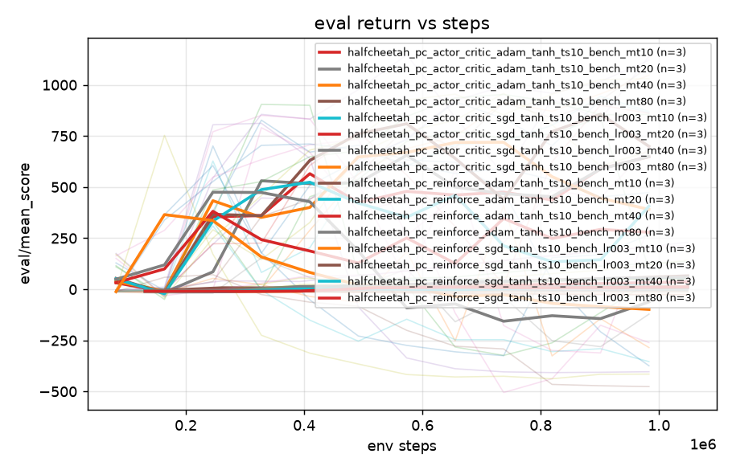
*§3.1 all 16 baseline configs.*

### 3.2 `trust_region_kl_clip` — clip the policy gradient (9 configs, 26 runs)

**Changed:** `train.max_grad_norm`: `null` → `1.0` (and `0.5` in one cell).

**Where it acts:** `src/pc_algorithms/pc_actor_critic.py:192-197`. This is the whole
change — the policy optimizer gets a clipping stage in front of it:

```python
make_optim   = optax.sgd if Config.optimizer == 'sgd' else optax.adam
policy_optim = make_optim(Config.learning_rate)
if Config.max_grad_norm is not None:                      # <-- the clip
    policy_optim = optax.chain(
        optax.clip_by_global_norm(float(Config.max_grad_norm)), policy_optim)
...
value_optim  = make_optim(Config.value_learning_rate)     # critic NOT clipped
```

So on every policy weight update, the full gradient vector `g` (all policy
parameters) is rescaled by `min(1, c/‖g‖₂)` before the optimizer sees it: if the
gradient is bigger than `c` it is shrunk to length `c`, otherwise it passes through
untouched. The critic is never clipped. Nothing else in the update changes — not the
target, not the inference, not the learning rate.

Note this is a *global-norm* clip: it can only shrink the gradient's **length**, never
change its **direction**. That distinction matters for the result below.

**Question:** if collapses are caused by occasional huge weight updates, does
bounding `‖g‖` prevent them?

| config | final | collapse | vs baseline |
|---|---|---|---|
| adam mt10 clip0.5 | 579 ± 154 | 0/2 | changed |
| adam mt10 clip1.0 | 855 ± 161 | 0/3 | 2 of 3 seeds bit-identical |
| adam mt20 clip1.0 | 649 ± 644 | 1/3 | **bit-identical** |
| adam mt40 clip1.0 | 391 ± 547 | 1/3 | **bit-identical** |
| adam mt80 clip1.0 | 875 ± 91 | 0/3 | changed (kl_max 2.91→1.43) |
| sgd mt10–80 clip1.0 | **−11 ± 2** | 0/3 | **fails to learn** |

**[verified]** Adam mt20 and mt40 with `clip=1.0` produce **bit-identical finals** to
no-clip (`[1121, 1088, −261]` and `[675, 870, −374]`). Checking the logs directly:
per-update `policy_grad_norm_max` in these runs has median 0.61 and peaks at
0.88–0.95, and **0.00% of updates in any seed exceeded 1.0** — the clip never fired
once. Earlier I attributed this to Adam renormalising the clip away; the real reason
is simpler: **the threshold sat above the entire gradient distribution.**

> **Two clipping experiments, read them together.** §3.2 (here) is the flawed first
> attempt: the threshold `1.0` was guessed, and it sat *above* the gradient
> distribution, so for Adam it never fired, while the SGD cells used the wrong
> learning rate. §3.6 is the corrected version: thresholds taken from the *measured*
> gradient distribution, SGD at the working `lr=0.03`. **Only §3.6 actually tests
> whether clipping helps.**

**[verified] The SGD clip runs are confounded.** `config.yaml` shows
`learning_rate: 0.0003` versus the working SGD baseline's `0.03` — **100× too small**.
They died of the learning rate, not the clipping. This invalidated the sweep and
motivated §3.6.

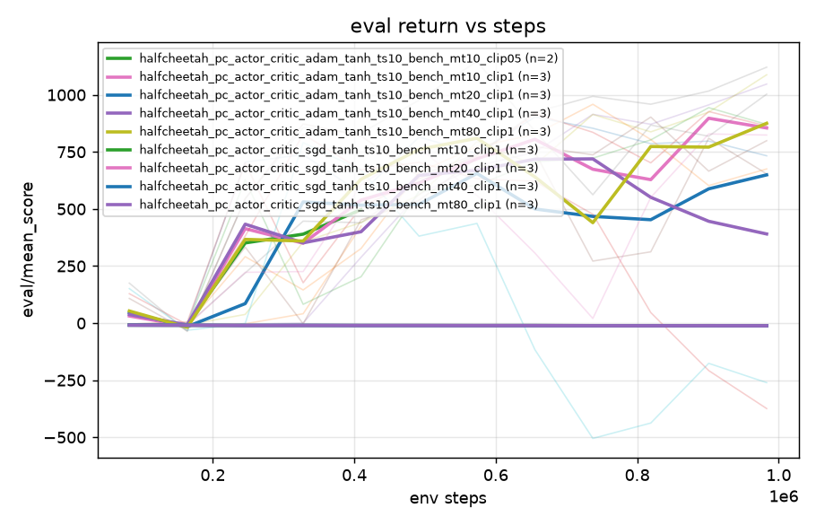
*§3.2 gradient clipping. SGD curves (lr=0.0003) are the flat lines at ~0.*

### 3.3 `trust_region_kl_tclip` — cap how far the target moves the mean (6 configs, 18 runs)

**Changed:** `train.target_clip`: `null` → `2.0` / `5.0`.

**Where it acts:** `src/pc_algorithms/gaussian_policy.py:82-85`. The PC target for
the Gaussian mean is `target_μ = μ + offset`, where
`offset = ts·A·(z−μ)/σ²`. With this set, the offset is clamped per coordinate
*before* the target is formed:

```
offset ← clip(offset, −2, +2)      # then target_μ = μ + offset
```

So it bounds the distance the target can pull the mean in one update, in raw
action-space units. It does not touch gradients or the optimizer, so it is
optimizer-independent — unlike §3.2.

**Question:** if the collapse comes from the target demanding too large a move,
does capping that move prevent it?

| config | final | best | collapse |
|---|---|---|---|
| adam mt20 tclip2 | 618 ± 566 | 1027 | 1/3 |
| adam mt20 tclip5 | 691 ± 269 | 945 | 1/3 |
| adam mt40 tclip2 | 705 ± 664 | 1069 | 1/3 |
| adam mt80 tclip2 | 781 ± 547 | 1039 | 1/3 |

**Finding.** Capping the target offset **raises peaks** — mean-of-best reaches 1069
(mt40 tclip2) and the single highest run in this sweep is 1341 (mt80 tclip2 seed 2),
above the 1147 maximum best of the unclipped baseline (§3.1 adam mt80 seed 3) — but it **never removes the
collapse**: 1/3 in every cell. A bound in action space is not the missing constraint.
(These are not the highest returns seen at bench scale overall: `stdglobal` mt10
seed 2 peaked at 2859 before collapsing 3/3, §3.4.)

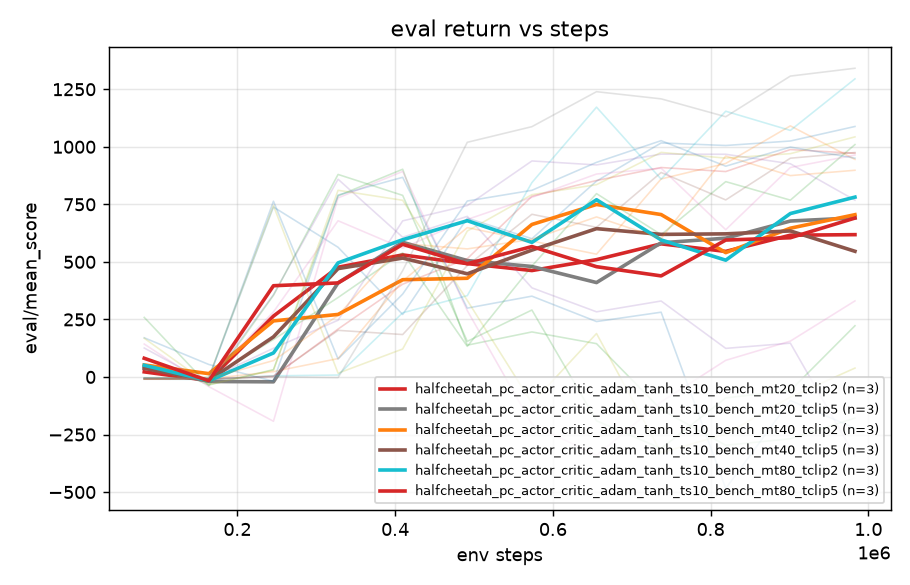
*§3.3 target clip: higher peaks, one collapsing seed per cell.*

### 3.4 `trust_region_kl_stdglobal` — one shared σ instead of a per-state σ (8 configs, 24 runs)

**Changed:** `agent.state_indep_std`: `false` → `true`.

**Where it acts:** `src/pc_algorithms/pc_actor_critic.py:210-218` (`_with_global_std`).
Normally the network outputs `[μ(s), log σ(s)]` — σ depends on the state. With this
flag, the network's `log σ(s)` output is discarded and replaced by a **single global
`log σ` vector** shared across all states. That vector is updated separately by the
batch-averaged Gaussian score (`pc_actor_critic.py:369-374`), which is the same
signal PPO's state-independent `log_std` parameter receives.

**Question:** PPO on MuJoCo uses exactly this parameterisation and is stable. Does
adopting it stabilise PCPG?

| config | final | collapse | kl_max | sat_max |
|---|---|---|---|---|
| adam mt10 | −647 ± 548 | **3/3** | 48.9 | 0.86 |
| adam mt20 | −599 ± 968 | 2/3 | **151.9** | 0.61 |
| adam mt40 | −524 ± 47 | 1/3 | 169.8 | 0.91 |
| adam mt80 | −451 ± 84 | 1/3 | 170.2 | 0.73 |
| sgd (all) | −46 … −0 | 0/3 ⚠ | 0.6–1.0 | 0.06 |

⚠ **vacuous**: no SGD `stdglobal` seed reached 300 (best ≤ 73). These runs did not learn; the 0/3 is not evidence of stability.

**Finding.** A **state-independent** `log_std` — exactly the parameterisation PPO
uses successfully here — is **catastrophic for PCPG**: `kl_max` up to 170, saturation
to 0.91, negative returns. In this implementation PCPG performs dramatically worse
with a state-independent σ. This is the
strongest evidence that PCPG's instability is *not* a shared "MuJoCo/tanh" issue: the
same parameterisation is fine for PPO in this codebase.

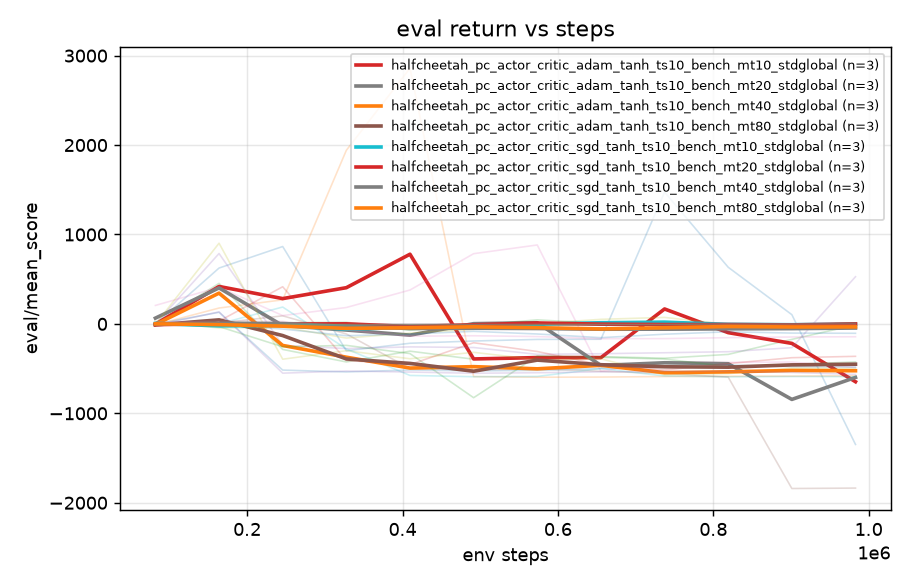
*§3.4 state-independent σ: Adam runs go strongly negative.*

### 3.5 `trust_region_kl_natural` — remove the `1/σ²` factor from the target ⭐ (4 configs, 12 runs)

**Changed:** `train.natural_target`: `false` → `true`.

**Where it acts:** `src/pc_algorithms/gaussian_policy.py:79-81`. The default
(Euclidean) target offsets are

```
mean:    offset_μ    = ts·A·(z−μ)/σ²
log_std: offset_logσ = ts·A·((z−μ)²/σ² − 1)
```

With the flag on, each is multiplied by the inverse Gaussian Fisher information —
`σ²` for the mean channel, `½` for the log-σ channel:

```
offset_μ    ← offset_μ · σ²  =  ts·A·(z−μ)      # the 1/σ² factor cancels
offset_logσ ← offset_logσ · 0.5
```

The `1/σ²` factor is the amplifier: as σ shrinks toward its floor (0.135), it
multiplies the target offset by up to ~55×. Removing it restores the Fisher-preconditioned
(natural-gradient) target predicted by the theory. Whether the resulting *weight*
update is a natural gradient additionally depends on inference converging, which is
not tested here.

**Question:** does removing that amplifier address the instability at its presumed
source, rather than clipping its consequences (§3.2, §3.3)?

| config | final | best | AUC | collapse | kl_max |
|---|---|---|---|---|---|
| **sgd mt20 nat** | **781 ± 47** | 862 ± 52 | **441 ± 18** | **0/3** | **0.04** |
| sgd mt80 nat | 357 ± 433 | 802 ± 114 | 384 ± 71 | 0/3 † | 0.06 |
| adam mt20 nat | 425 ± 491 | 753 ± 28 | 284 ± 116 | 1/3 | 0.30 |
| adam mt80 nat | 369 ± 480 | 812 ± 116 | 341 ± 118 | 1/3 | 0.32 |

† `sgd mt80 nat` seed 2 has `severe_collapse = 1`: it peaked at 680 and ended at
**−62**. The collapse rule missed it (needs 3 consecutive sub-threshold evals), so
"0/3" overstates its stability.

Per-seed finals for the mt20 winner: **759 / 738 / 846** — the tightest spread in this
project (population std 47).

**Finding.** The natural target is the only strategy tested that produces a clean 3-seed
result — **but only under SGD**. Same target under Adam still spikes to `kl_max` 0.30
and still collapses 1/3. **Because the same target behaves differently under SGD and
Adam, the stability cannot be explained by the target alone; it depends on the
optimizer-target interaction.** `mt80` adds seed variance without benefit.

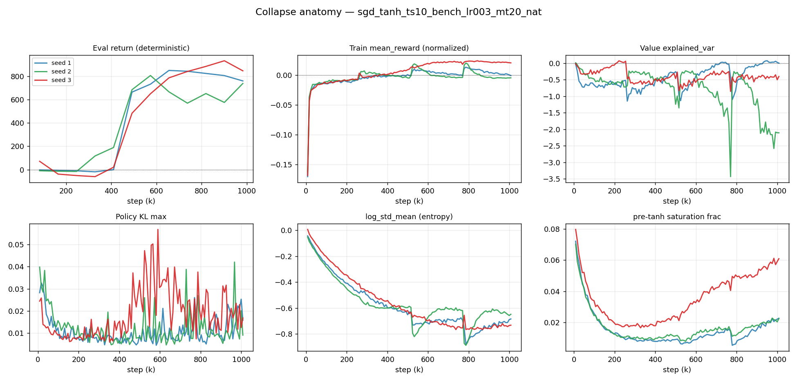

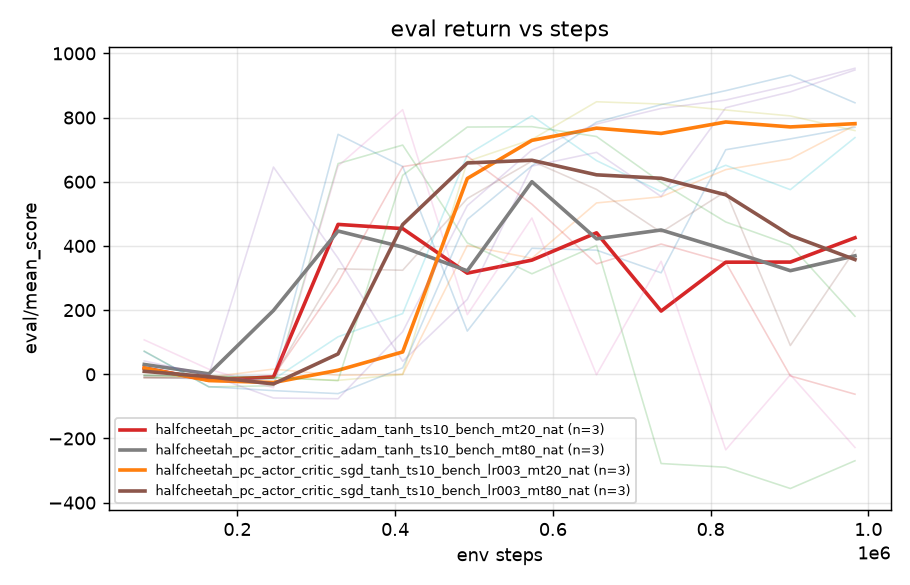
*§3.5 natural target: the SGD mt20 curves are the tight bundle.*

### 3.6 `gradclip_probe` — clip the policy gradient, with thresholds from the measured gradient distribution (4 configs, 10 runs)

**Changed:** `train.max_grad_norm`: `null` → `10.24` / `4.39` / `1.46`, on
`halfcheetah_pc_actor_critic_sgd_tanh_ts10_bench_lr003_mt20` — i.e. **SGD at the
working `lr=0.03`**, `natural_target` left `false` so the `1/σ²` factor is retained.
Same code path as §3.2 (`pc_actor_critic.py:192-197`).

**Why these three values:** §3.2 guessed `1.0`, which turned out to be above the
gradient distribution and never fired. Here a first run with clipping off measured
the actual distribution of `‖g‖` (new logging: `diag/policy_grad_norm_p50/p90/p99/p999`
and `diag/policy_grad_norm_bind_rate`, `pc_actor_critic.py:412-425`), and the three
thresholds were set at its p99.9, p99 and p99/3 so that each fires at a known rate.

**Question:** are the collapses caused by rare large gradients — which a threshold
placed in the measured tail would catch?

Measured tail (clip-free): **p50 0.671, p90 0.941, p99 4.387, p99.9 10.24** → tail
ratio **6.5×**. The gradient-norm distribution has a pronounced empirical upper tail,
as Marco predicted.

| clip | bind rate | kl_max | final | collapse |
|---|---|---|---|---|
| none | 0% | 6.25 | 267 (n=1) | 1/1 |
| 10.24 (p99.9) | 0.07% | 12.1 / 8.9 / 0.31 | 294 ± 466 | 2/3 |
| 4.39 (p99) | 0.47% | 3.49 / 2.48 / 0.31 | 280 ± 503 | 2/3 |
| 1.46 (p99/3) | **1.56%** | **0.46 / 0.53 / 0.37** | 272 ± 475 | 1/3 |

**Finding.** The clip fired, yet collapses still occurred. At `max_grad_norm=1.46`
it clipped 1.56% of all policy updates and reduced `kl_max` from 6–12 to ~0.4 — so the
realised policy step per update dropped more than 10× — and mean returns remained
essentially unchanged (267 → 294 → 280 → 272). Collapse count went 2/3 → 2/3 → 1/3,
which is within seed noise at n=3. Per seed, the outcome is determined by the seed, not the clip
value: seed 2 collapses at all three thresholds (−285 / −371 / −257) and seed 3 does
not collapse at any (855 / 855 / 895).

**Why it did not work.** The clip does the one thing it can do — it shortens
over-long gradients — and that was verifiably enough to bring the realised policy step
down to natural-target levels (`kl_max` ~0.4, vs 0.04 for the natural target and 6–12
unclipped). The returns did not follow. Two reasons are consistent with the data:

1. **The collapse is gradual, not a single bad update.** In these runs at
   `clip=1.46`, seed 1's decline spans 245k→737k (491k steps) with per-update
   `kl_max` median 0.117 (p90 0.247, max 0.455); seed 2's spans 737k→819k (81k steps)
   with median 0.197 (max 0.347). So the policy change per update stays modest
   throughout — there is no single oversized update for a clip to intercept, just a
   long sequence of ordinary-sized ones moving the policy consistently in one
   direction. A global-norm clip shortens each step but does not change its
   direction, so it slows the walk without changing where it leads.
2. **The gradient norm does not separate collapsing from healthy runs.** In these
   Euclidean runs the norm does roughly double during a collapse (seed 1
   0.552 → 1.005; seed 2 0.750 → 1.942), so Marco's mechanism is visible. But the
   *healthy* seed 3 sits flat at **1.04** — higher than crashing seed 1 ever reaches.
   A threshold on `‖g‖` therefore cannot distinguish the two: any cut low enough to
   catch seed 1's collapse also fires constantly on the seed that is doing fine.
   (Under the *natural* target the signal is absent altogether — see §4.3.)

**Conclusion within this experiment:** clipping the gradient norm does not prevent
the collapse of the Euclidean update. The controlled comparison is
clip-vs-no-clip *inside this sweep* (267 → 294 / 280 / 272, all same config).

⚠ **Do not read "272 vs 781" as a clean contrast.** The §3.5 winner differs from
these runs in **two** variables — `natural_target` *and* `max_grad_norm` — so that
gap cannot be attributed to either alone. Testing "does clipping substitute for the
natural target?" needs natural+clip and Euclidean+no-clip cells that do not exist yet.

What clipping does **not** touch, and what remains untested: gradient *direction* (e.g. whether consecutive gradients are
strongly aligned, which would produce exactly the observed slow drift), Adam's
preconditioned update size, per-parameter or per-sample spikes hidden inside the
global norm.

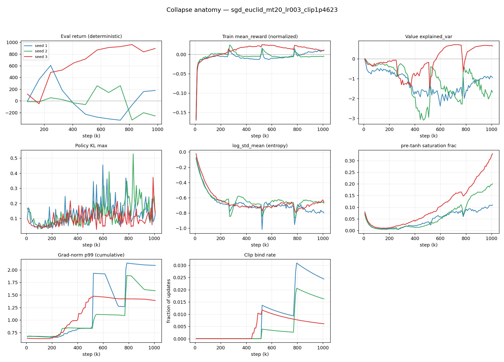

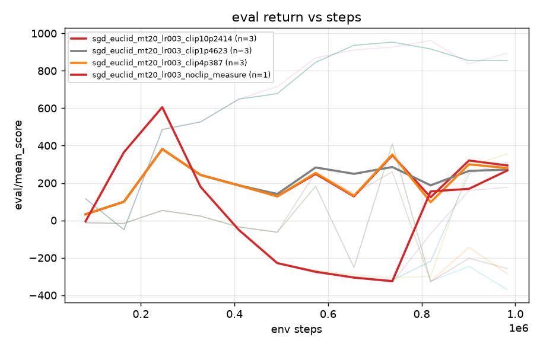
*§3.6 all clip thresholds land in the same band.*

### 3.7 `knob_fill_smin_vlr` — raise the min allowed σ; change the critic's learning rate (4 configs, 12 runs)

Two independent changes, each aimed at one of the two observed failure patterns.

**(a) `agent.log_std_min`: `−2.0` (default) → `−1.5` / `−1.0`**, applied to the
collapsing `adam ... mt20_nat` config.
*Where it acts:* `pc_actor_critic.py:142-143` overwrites the module constant
`gaussian_policy.LOG_STD_MIN`, which clamps `log σ` in two places — when sampling
(`gaussian_policy.py:28`) and when forming the target (`gaussian_policy.py:86-87`).
Effect: the smallest allowed policy standard deviation rises from
`exp(−2) = 0.135` to `exp(−1.5) = 0.223` or `exp(−1) = 0.368`. This both preserves
exploration and caps the `1/σ²` amplifier.
*Question:* the Adam collapses coincide with rising tanh saturation and shrinking σ —
does forbidding σ from getting small prevent them?

**(b) `train.value_learning_rate`: `3e-4` → `1e-4` / `1e-3`**, applied to the
degrading `sgd ... mt80_nat` config.
*Where it acts:* `pc_actor_critic.py:198` — the critic's optimizer only
(`value_optim = make_optim(Config.value_learning_rate)`). The actor's
`train.learning_rate` is unchanged at `0.03`.
*Question:* the SGD degradations coincide with `value_explained_var` diverging to
≈ −3 — is that controllable by changing how fast the critic fits?

| change | value | final | best | collapse |
|---|---|---|---|---|
| `log_std_min` (Adam nat mt20) | −2 (base) | 425 ± 491 | 753 | 1/3 |
| | −1.5 | 514 ± 576 | 866 | 1/3 |
| | −1.0 | 496 ± 551 | **893** | 1/3 |
| `value_lr` (SGD nat mt80) | 1e-4 | 310 ± 381 | 662 | 0/3 |
| | 3e-4 (base) | 357 ± 433 | 802 | 0/3 |
| | 1e-3 | 496 ± 419 | 674 | 0/3 |

**Finding.** Both negative for stability. The σ floor lifts peaks (753→893) and is
demonstrably active — final `log_std_mean` is −0.28 at floor −1.0 and −0.55 at floor
−1.5, versus −0.84 in the floor −2.0 baseline — yet collapse stays 1/3.
Critic LR moves the mean but not the ±420 spread. Neither beats SGD+natural+mt20.

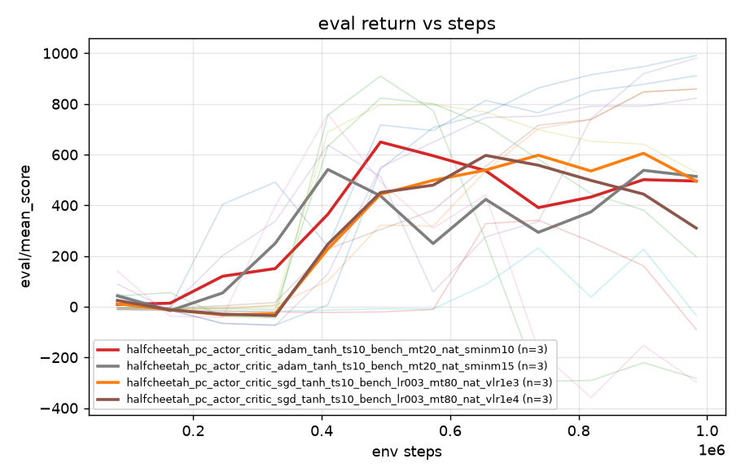
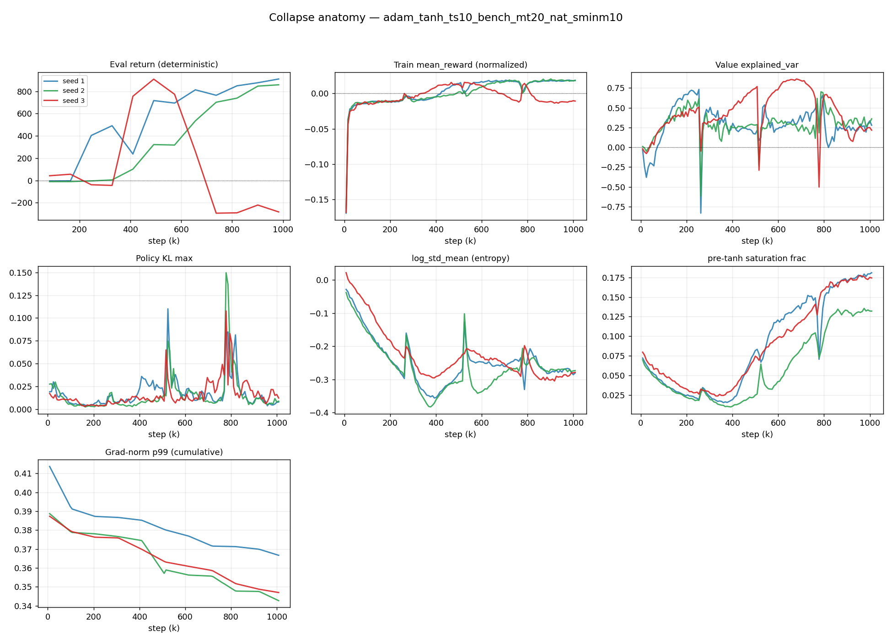
*§3.7 σ floor active (log_std ≈ −0.28) yet seed 3 still collapses at ~650k.*

### 3.8 5M-scale sweeps

**`benchmark_halfcheetah_pcpg_5m_27runs_20260721`** (9 configs, 27 runs, 5M,
[256,256], 1024 envs). This is the sweep that `scripts/run_pcpg_overnight_sweep.py`
generates; two empty scaffolding copies (`overnight_halfcheetah_sota_sweep{,_01}/`,
configs but no logs) were removed since the data lives here.

| config | final | best | collapse |
|---|---|---|---|
| adam ts04 | **1424 ± 889** | 1953 | 2/3 |
| adam ts05 lr0002 | 1349 ± 1537 | 1821 | 2/3 |
| adam ts07 lr0002 | 1313 ± 784 | 1560 | 3/3 |
| adam ts07 lr0001 | 1097 ± 500 | 1442 | 2/3 |
| adam ts06 | 848 ± 887 | 1538 | 2/3 |
| sgd ts05 lr001 | 676 ± 1038 | 719 | 0/3 |
| sgd ts05 lr0003 | 164 ± 267 | 176 | 0/3 |
| **sgd ts05 lr003** | **−192 ± 55** | 1348 | **3/3** |

**`benchmark_halfcheetah_capacity_5m`** — single best seed ever: **2937** (adam ts07),
but 2/3 collapse; ts05 gave 2902 then −604/−480.

**Finding.** The 5M/[256,256]/1024-env runs reach much higher returns than the
1M/[64,64]/256-env bench runs (≈2900–3200 vs ≈1100) and remain unreliable (2–3 of 3
collapsing in most Adam cells). ⚠ That comparison changes **capacity, batch size and
step budget together**, so it does not isolate capacity.

⚠ **On promoting §3.5 to 5M — the evidence is weaker than it looks.**
`sgd ts05 lr003 5m` does collapse 3/3, and it shares the optimizer and actor
`lr=0.03` with the §3.5 winner. But it differs in **5 of 12** config fields:
`target_scale` 1.0→0.5, `natural_target` **True→False**, `width` 64→256,
`num_envs` 256→1024, `steps` 1M→5M. In particular it does **not** use the natural
target, which is the whole point of §3.5. So this run is *not* the §3.5 recipe at
5M and cannot show that recipe is unsafe. **The actual experiment — natural target,
ts=1.0, SGD lr=0.03, at 5M — has never been run.**

The SGD rows marked 0/3 are also weak evidence: `sgd ts05 lr0003` had 1 of 3 seeds
reach viability and `sgd ts05 lr001` likewise, so those 0/3 counts are largely
vacuous.

**`pcr_sota`** (PC-REINFORCE, 8 configs, 24 runs, 5M): the single highest peak in
this whole project — **3522** (ts06 seed 2) — followed by catastrophic collapse:
finals ≈ −500 to −600 on most seeds, with pre-tanh saturation reaching **1.000** on
that same run. Confirms §3.1: no critic ⇒ high ceiling, no floor.

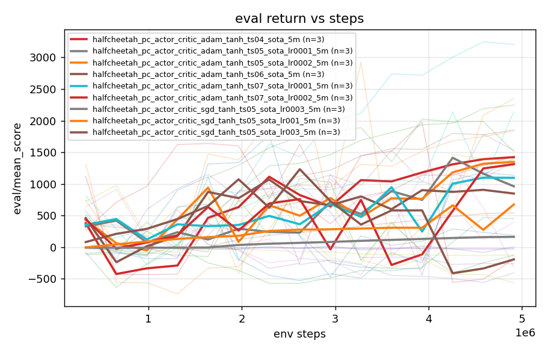
*§3.8 5M capacity-matched: higher peaks, collapses persist.*

---

## 4. Verified claims and their evidence

| claim | evidence | status |
|---|---|---|
| SGD+natural+mt20 is 0-collapse at 1M | seeds 759/738/846 | **holds (n=3)** |
| Natural target alone doesn't stabilise | Adam+nat still 1/3, kl_max 0.30 | **holds** |
| Clipping `‖g‖` does not prevent collapse | 1.56% of updates clipped, kl_max 6→0.4, returns flat | **holds** |
| Adam clip1.0 was a no-op in 2 cells | bit-identical finals | **[verified]** |
| Old SGD clip runs are invalid | `lr=0.0003` vs `0.03` in config.yaml | **[verified]** |
| Global σ destroys Adam runs | −599 ± 968, kl_max 152, 2/3 collapse | **holds** |
| Global σ "kills SGD" | SGD rows never reached viability; cannot separate "σ broke it" from "never learned" | **ambiguous** |
| Transformation matches PPO | same `NormalTanhDistribution`; Jacobian in `log_prob`; no `μ,σ` dependence in tanh correction | **holds (code)** |
| ~~KL shock causes the collapse~~ | see §4.1 | **RETRACTED** |
| Deterministic-eval explains it | see §4.2 | **REFUTED** |

### 4.1 Retracted: "a shared KL shock knocks the run over"

**[verified]** Selection here is *not* the `collapse` flag of §1b — it is the 16
runs in `trust_region_kl_natural` + `knob_fill_smin_vlr` + `gradclip_probe` whose
eval curve falls **more than 400** from peak to trough (the analyzer flag marks only
10 of the 34 runs in those folders; this wider net is deliberate, to avoid selecting
on the metric under scrutiny). Across those 16, the `kl_max` spike is **after the
collapse trough in 5**, **before the peak in 2**, and inside the (often ~500k-step)
decline window in 9 — where it carries little information. Concretely, `sminm10` seed 3:
eval peaks 491k, troughs 737k, `kl_max` at **778k** — after the decline had already
completed. And in that config the seed with the **largest** spike (seed 2, 0.150)
**survived at 859**, while the crashing seed 3 had the **smallest** (0.108). The data
do not support the KL spike as the primary cause.

### 4.2 Refuted: "stochasticity protects training; only deterministic eval collapses"

**[verified]** `training/mean_reward` is the stochastic policy. Selecting the 9 runs
whose eval falls >300 from peak to *final* (again a wider net than the §1b flag): in
**6 of 9** the training reward falls too, and in the two Adam natural cases it
**changes sign** (+0.0128 → −0.0111; +0.0166 → −0.0102). The policy genuinely
degrades, so the collapse is not an artefact of evaluating at `tanh(μ)`.

### 4.3 Current best signature (correlational only)

Gradient norms carry **no** collapse signal under the natural target — crashing seeds
have equal or *lower* norms than survivors (0.204→**0.199** while crashing; healthy
0.264). The strongest empirical correlate observed across all three experiment
families is:

| | `\|μ\|` growth | saturation |
|---|---|---|
| crashing (7 runs) | **1.2–3.1×** | rises |
| healthy (6 runs) | 1.11–1.27× | ~flat |

⚠ **Pooling caveat.** These 13 runs come from three different families (Adam+natural,
SGD+natural, SGD+Euclidean) with different optimizers, targets and σ floors, and
"crashing"/"healthy" is the >400 peak-to-trough split of §4.1, not the §1b flag. The
ranges do not overlap, but pooling heterogeneous configs at n=13 is weak support for
a discrimination claim.

**This is a signature, not a cause.** Saturation *level* does not discriminate —
healthy `sminm10` seed 1 runs at 0.119 saturation and scores 911, *higher* than
crashing seed 3's 0.099. Only the *growth* separates them, and `|μ|` growth could be
cause, symptom, or bystander.

---

## 5. What is not established

1. **Causality of `|μ|` growth.** Needs the frozen-checkpoint intervention:
   evaluate a collapsed checkpoint under `tanh(clip(μ,−b,b))`. If return recovers,
   μ-magnitude is functionally responsible; if not, it is downstream.
2. **What makes μ grow.** Untested: gradient *direction* (cosine similarity across
   updates — moderate but aligned gradients would produce exactly the observed slow
   monotone drift), Adam's preconditioned update norm `‖m̂/(√v̂+ε)‖` vs `‖g‖`,
   per-layer/per-head decomposition.
3. **Whether SGD+natural+mt20 survives 5M — untested.** The 5M SGD lr=0.03 cell
   that collapses 3/3 is a *different* configuration (Euclidean target, ts=0.5,
   [256,256], 1024 envs), so it says nothing directly about the §3.5 recipe. Running
   natural+ts1.0+SGD lr0.03 at 5M is the missing experiment.
4. **Statistical power.** Every cell is n=3.

### Blocker
All sweep scripts run `--no-save`, so **no checkpoints exist**. Every decisive
intervention in (1) and (2) requires periodic checkpoints *plus* optimizer moments,
RNG state, and obs/reward normaliser state. That is the prerequisite work.

---

## 6. Reproduce

```bash
python scripts/run_pcpg_knob_fill.py --seeds 1 2 3 --skip-complete
python scripts/run_gradclip_probe.py --stage auto --seeds 1 2 3
python scripts/analyze_pcpg_logs.py --results-dir results/<dir>
python scripts/plot_collapse_anatomy.py --results-dir results/<dir>
bash scripts/run_overnight_batch.sh            # both, unattended, auto-stops the pod
```

Each `results/<dir>/<config>/` holds `config.yaml` (exact resolved config),
`meta.json` (git commit, timestamp), `seed_N.log` (per-update diagnostics).

**Naming gotcha:** `lr003` = 0.03, `lr0003` = 0.003.

## 7. Folder map

| folder | configs | runs | steps |
|---|---|---|---|
| `trust_region_kl` | 16 | 48 | 1M |
| `trust_region_kl_clip` | 9 | 26 | 1M |
| `trust_region_kl_stdglobal` | 8 | 24 | 1M |
| `trust_region_kl_tclip` | 6 | 18 | 1M |
| `trust_region_kl_natural` | 4 | 12 | 1M |
| `knob_fill_smin_vlr` | 4 | 12 | 1M |
| `gradclip_probe` | 4 | 10 | 1M |
| `benchmark_halfcheetah` | 7 | 21 | 1M |
| `benchmark_halfcheetah_pcpg_5m_27runs_20260721` | 9 | 27 | 5M |
| `benchmark_halfcheetah_capacity_5m` | 3 | 9 | 5M |
| `pcr_sota` | 8 | 24 | 5M |


Every folder with logs has `per_run.csv`, `SUMMARY.md`, `learning_curve.png`,
`diagnostic_plots.png`, and per-config `collapse_anatomy_<config>.png`.
